# Modélisation — Détection de divergences API (MDES & PowerCARD)

Ce document modélise l'ensemble du travail réalisé dans ce projet : deux chantiers de détection de divergences documentaires/structurelles entre spécifications d'API, partageant un même moteur de comparaison.

Diagrammes en **PlantUML** — à rendre via [plantuml.com/plantuml](http://www.plantuml.com/plantuml) (coller le bloc de code), l'extension VS Code "PlantUML", ou tout viewer markdown compatible.

---

## 1. Vue d'ensemble

Deux chantiers distincts, un moteur de diff commun :

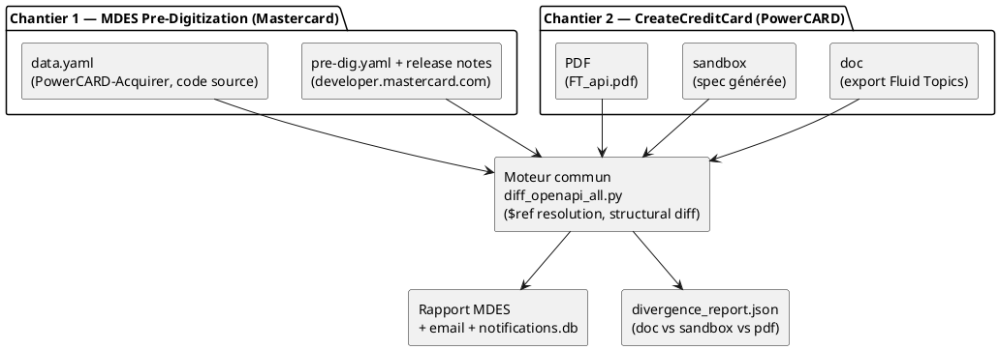

---

## 2. Chantier 1 — Pipeline MDES (`mc_divergence/`)

### 2.1 Architecture des composants

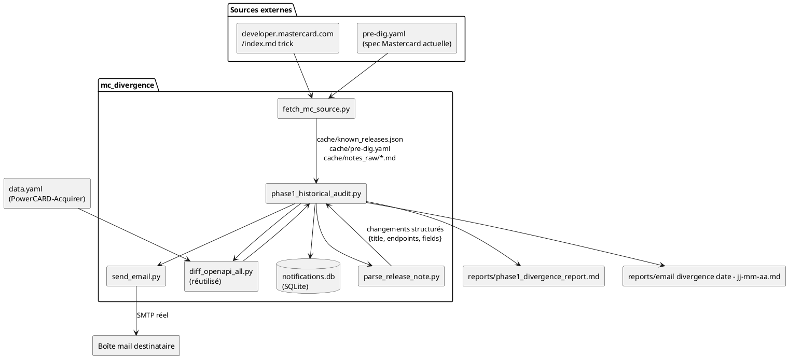

### 2.2 Modèle de données — un "changement" de release note

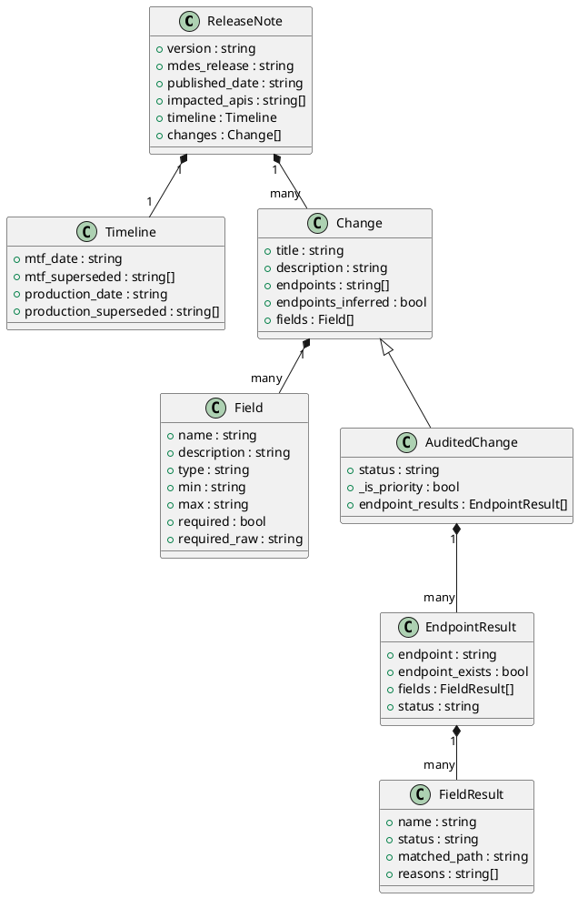

**Statuts possibles** (`STATUS_RANK`, du plus grave au moins grave) :
`non_implemente` (3) → `a_verifier_manuellement` (2) → `partiel` (1) → `implemente` (0)

### 2.3 Séquence — exécution de `phase1_historical_audit.py`

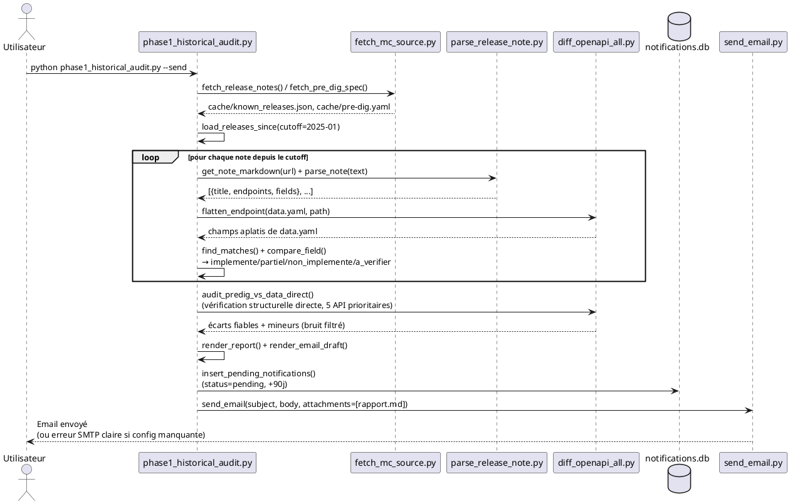

### 2.4 Modèle de la table `notifications` (SQLite)

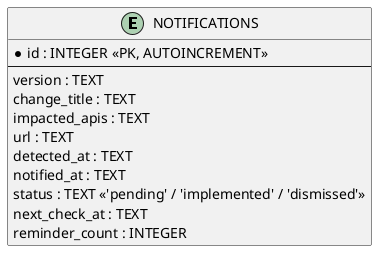

### 2.5 État d'avancement

| Composant | Statut |
|---|---|
| `fetch_mc_source.py` | ✅ Fait |
| `parse_release_note.py` | ✅ Fait (4 formats de tableau gérés) |
| `phase1_historical_audit.py` | ✅ Fait (audit note + vérification directe pre-dig.yaml) |
| `send_email.py` | ✅ Fait (SMTP réel, pièces jointes, `.env`) |
| `phase2_job_a_new_release_alert.py` | ❌ Pas fait |
| `phase2_job_b_recheck_sweep.py` | ❌ Pas fait |

---

## 3. Chantier 2 — CreateCreditCard (`credit card/`)

### 3.1 Architecture

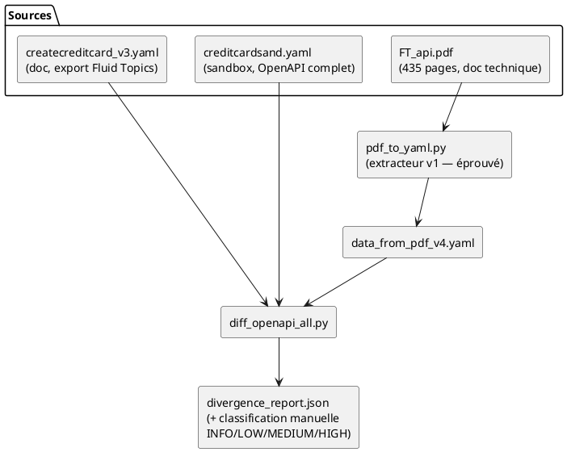

### 3.2 Résultat de la comparaison doc vs sandbox (fraîchement rejouée)

*(le rendu en camembert n'est pas supporté par le moteur PlantUML testé — tableau à la place)*

| Catégorie | Nombre | % du total (1317) |
|---|---:|---:|
| Bruit (`pattern`/`minLength`/`maxLength`/`required`) | 968 | 73.5% |
| `description_drift` (cosmétique) | 234 | 17.8% |
| `field_missing_in` (dont 68 = pattern `keyValues[]`) | 72 | 5.5% |
| `enum` | 18 | 1.4% |
| `format` | 17 | 1.3% |
| `type` | 2 | 0.2% |
| `required_set_mismatch` | 2 | 0.2% |
| `content_type_mismatch` | 1 | 0.1% |

### 3.3 Causes racines identifiées (signal réel, après filtrage du bruit)

| Cause | Détail |
|---|---|
| Pattern `keyValues[]` absent du sandbox | 68 occurrences à ~17 emplacements imbriqués différents — un seul vrai sujet, pas 68 |
| 4 champs isolés absents du sandbox | `communicationChannels[].channelContent`, `customerDetails.existingClient(+.bankCode,.clientCode)` |
| `required_set_mismatch` (requête) | doc exige `cardDetails`+`creditAccount`+`customerDetails`+`requestInfo` ; sandbox n'exige que 2 des 4 |
| `required_set_mismatch` (réponse 200) | doc exige `responseInfo` ; sandbox n'exige rien — **pattern répété : sandbox sous-documente systématiquement les réponses** |
| 2 `type` mismatch réels | `auxiliaryFeeAmount`, `numberOfDependents` : `string` (doc) vs `number` (sandbox) |
| 2 `format` mismatch réels | `tmpPreferenceStartDate`/`tmpPrefernceEndDate` : `date` (doc) vs `date-time` (sandbox) |
| 17 `enum` où sandbox est plus précis | doc ne liste aucune valeur, sandbox si (ex. `phoneType: [0-4]`, `gender: [M,F,N]`) — **doc à enrichir** |

### 3.4 Le PDF — un vocabulaire différent, pas la même API renommée

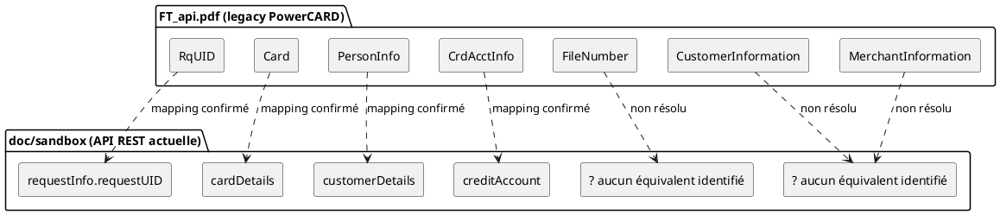

---

## 4. Chantier 3 (préparatoire) — Nouveau PDF confidentiel

Document décrit mais jamais vu (confidentialité) — extracteur écrit à l'aveugle, **jamais testé**.

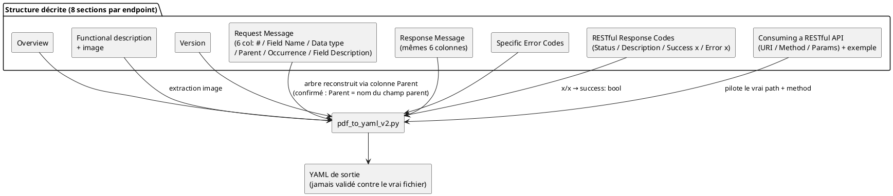

**Différence clé vs v1** : la hiérarchie ne dépend plus des liens hypertexte vers des tables "Complex Type: X" — chaque ligne indique directement son parent par son nom de champ. L'ancien mécanisme est conservé en repli uniquement.

**État** : script écrit et syntaxiquement valide, **zéro exécution réussie** — le PDF réel est confidentiel et non accessible dans cette session. Toute incertitude de structure (libellés de section, seuil de taille de police pour distinguer un titre d'un en-tête de tableau) est signalée par des `WARNING` explicites sur `stderr`, jamais silencieuse.

---

## 5. Récapitulatif des scripts du projet

| Fichier | Rôle | Statut |
|---|---|---|
| `diff_openapi_all.py` | Moteur de diff générique (2+ sources, $ref resolution, réparation YAML) | ✅ Éprouvé, réutilisé partout |
| `pdf_to_yaml.py` | Extraction PDF → YAML (ancienne structure, `FT_api.pdf`) | ✅ Éprouvé |
| `pdf_to_yaml_v2.py` | Extraction PDF → YAML (nouvelle structure avec Parent, confidentielle) | ⚠️ Jamais testé |
| `check_field_changes.py` | Vérification champ-par-champ ciblée (liste de changements manuels) | ✅ Fait |
| `diff_predig_vs_data.py` | Diff direct `pre-dig.yaml` ↔ `data.yaml` (résolution des `$ref` niveau conteneur) | ✅ Fait |
| `mc_divergence/fetch_mc_source.py` | Récupération + cache des sources Mastercard | ✅ Fait |
| `mc_divergence/parse_release_note.py` | Parsing des notes de release (4 formats de tableau) | ✅ Fait |
| `mc_divergence/phase1_historical_audit.py` | Orchestration Phase 1 complète | ✅ Fait |
| `mc_divergence/send_email.py` | Envoi SMTP réel avec pièces jointes | ✅ Fait |
| `mc_divergence/phase2_job_a_new_release_alert.py` | Alerte nouvelle release (Phase 2) | ❌ À faire |
| `mc_divergence/phase2_job_b_recheck_sweep.py` | Relance des rappels à échéance (Phase 2) | ❌ À faire |

---

## 6. Diagramme de cas d'utilisation — vue d'ensemble du projet

Couvre les 3 chantiers et leurs acteurs (utilisateur, source externe Mastercard, transport email). Les cas non encore implémentés (Phase 2) sont marqués explicitement.

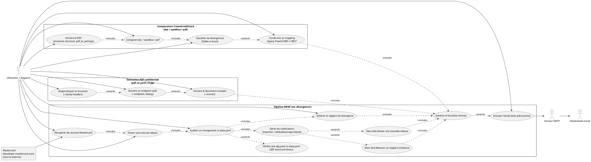

---

## 7. Diagramme de cas d'utilisation — Pipeline MDES uniquement

Version isolée du chantier Mastercard seul (sans CreateCreditCard ni l'extraction PDF confidentielle), pour une lecture ciblée.

```plantuml
@startuml
left to right direction
skinparam packageStyle rectangle

actor "Utilisateur / Stagiaire" as User
actor "Serveur SMTP" as SMTP
actor "Destinataire email" as Dest
rectangle "Mastercard\n(developer.mastercard.com)\n(source externe)" as MC

rectangle "Pipeline MDES (mc_divergence/)" {
  usecase "Récupérer les sources Mastercard" as UC1
  usecase "Parser une note de release" as UC2
  usecase "Auditer un changement vs data.yaml" as UC3
  usecase "Vérifier pre-dig.yaml vs data.yaml\n(diff structurel direct)" as UC4
  usecase "Générer le rapport de divergence" as UC5
  usecase "Générer le brouillon d'email" as UC6
  usecase "Envoyer l'email (avec pièce jointe)" as UC7
  usecase "Gérer les notifications\n(insertion / dédoublonnage SQLite)" as UC8
  usecase "(Non fait) Alerter une nouvelle release" as UC8a
  usecase "(Non fait) Relancer un rappel à échéance" as UC8b
}

User --> UC1
User --> UC2
User --> UC3
User --> UC5
User --> UC7

MC --> UC1

UC1 ..> UC2 : <<include>>
UC2 ..> UC3 : <<include>>
UC3 ..> UC4 : <<extend>>
UC3 ..> UC8 : <<include>>
UC3 ..> UC5 : <<include>>
UC5 ..> UC6 : <<include>>
UC6 ..> UC7 : <<extend>>
UC7 --> SMTP
SMTP --> Dest

UC8 ..> UC8a : <<extend>>
UC8 ..> UC8b : <<extend>>
UC8a ..> UC6 : <<include>>
UC8b ..> UC6 : <<include>>
@enduml
```

---

## 8. Diagramme de classes — CreateCreditCard (doc / sandbox / pdf)

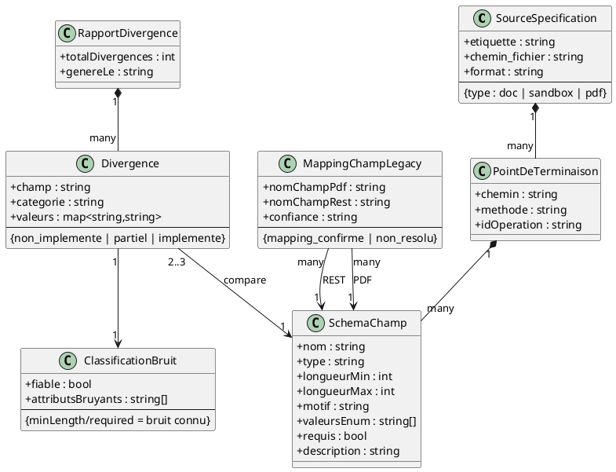

---

## 9. Diagramme de classes — Mastercard MDES (enrichi)

Reprend et enrichit le modèle de la section 2.2 en ajoutant les classes utilisées par `field_changes_vs_data_report.py` (`ApiFieldChangeEntry`, `PreDigFieldDefinition`, `DataYamlFieldDefinition`).

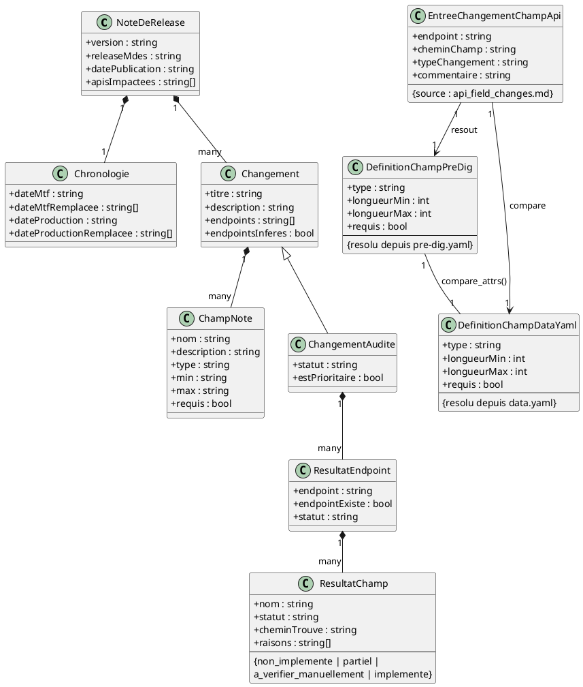

---

## 10. Diagramme de cas d'utilisation — Comparaison CreateCreditCard uniquement

Version isolée du chantier CreateCreditCard seul (sans MDES ni l'extraction PDF confidentielle). Un seul acteur : pas de source externe active (les 3 fichiers doc/sandbox/pdf sont déjà en place), pas de flux email/SMTP pour ce chantier. Les cas marqués "(Non fait)" sont recommandés mais jamais réalisés dans cette session.

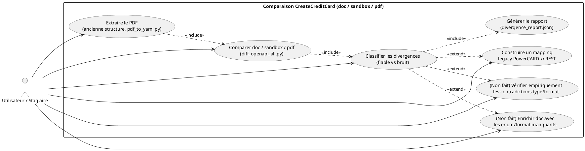

---

## 11. Diagramme de séquence — Comparaison à 3 inputs (docs / Fluid Topics / data.yaml)

Diagramme de conception — cette combinaison précise de sources n'a pas été exécutée dans cette session, il modélise le flux prévu. `Fluid Topics` = `FT_api.pdf` (le nom du fichier signifie "Fluid Topics API"), extrait au préalable en YAML structuré via `pdf_to_yaml.py`.

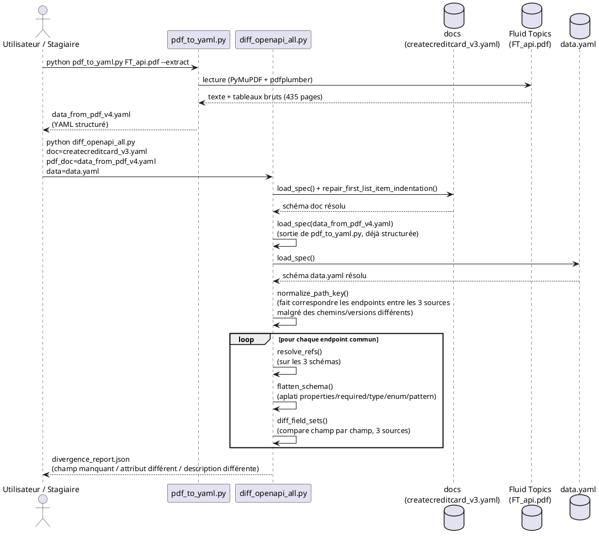

---

## 12. Diagramme d'activité avec couloirs (équivalent BPMN) — Pipeline MDES

PlantUML n'a pas de vraie notation BPMN 2.0 native (pas de pools/lanes/gateways BPMN) — ceci est un diagramme d'activité UML avec couloirs, visuellement équivalent (mêmes losanges de décision, mêmes couloirs par rôle), reflétant fidèlement la logique réelle de `phase1_historical_audit.py` (`audit_change()`, `compare_field()`, le flag `--send`, la gestion d'erreur SMTP).

Deux flux distincts : le premier couvre la vérification structurelle directe par endpoint ; le second couvre le filtrage des notes de release pertinentes avant de passer au traitement email.

### Flux 1 — Vérification structurelle directe (endpoints, sans passer par les notes)

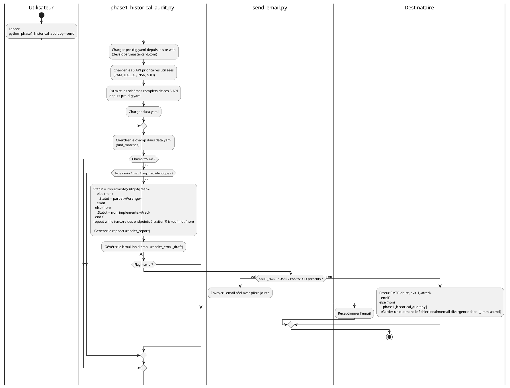

### Flux 2 — `releases_check()` : filtrage des notes de release pertinentes

Le process email n'est pas un placeholder — c'est littéralement le même bloc que dans le Flux 1 (génération du rapport, brouillon email, insertion notifications, envoi SMTP).

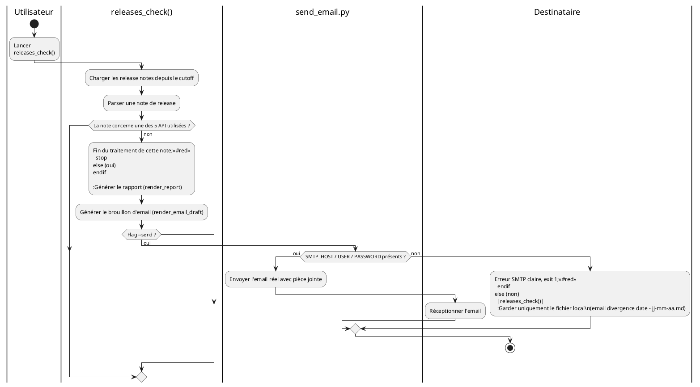
